# -YouTube-Video-Uploader---Complete-Automated-System
## 📖 Project Introduction
**YouTube Auto Uploader** is a fully automated system designed to upload videos from your **AWS S3 bucket** directly to your **YouTube channel** without any manual effort.  
The system automatically uploads **2 videos per day** — one at **9:00 AM** and another at **8:00 PM**, while also sending **email notifications** for successful uploads.

---

## 🏗️ Architecture Overview
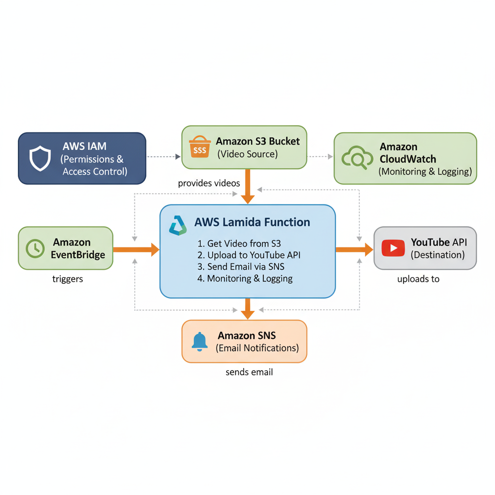

## 🚀 How the Project Works

### ⚙️ Complete Workflow

1. 🕒 **Scheduled Trigger** — AWS EventBridge triggers the Lambda function daily at **9 AM** and **8 PM**.  
2. 📹 **Video Selection** — Lambda selects a **random video** from the S3 bucket.  
3. ⬇️ **Download** — The video is downloaded from S3 to Lambda's **temporary storage**.  
4. 📤 **YouTube Upload** — Video is uploaded via the **YouTube Data API**.  
5. 📧 **Notification** — **SNS notification email** is sent for success or failure.  
6. 🧹 **Cleanup** — Temporary files are automatically deleted.

---

### 🌍 Real-Life Automation Benefits

✅ **No Manual Work** – Fully automated system  
✅ **Time Saving** – Automatically uploads 2 videos daily  
✅ **Reliable** – High reliability using AWS services  
✅ **Scalable** – Can handle 1000+ videos easily  
✅ **Monitoring** – Real-time status via email notifications

## 🛠️ How the Project is Built - Complete Technical Stack

### 1. AWS Lambda
**Purpose:** Main processing engine  

**Role:**  
- Download videos from S3  
- Upload videos to YouTube  
- Send notifications  

**Configuration:**  
- Runtime: Python 3.9  
- Memory: 1024 MB  
- Timeout: 15 minutes  
- Handler: `lambda_function.lambda_handler`  

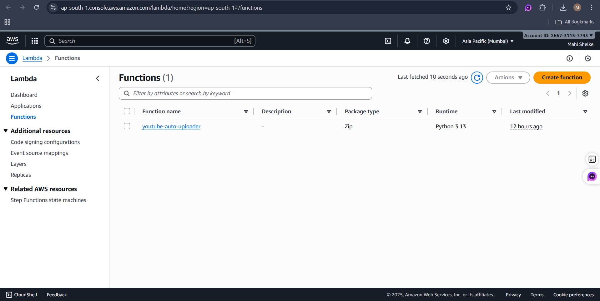
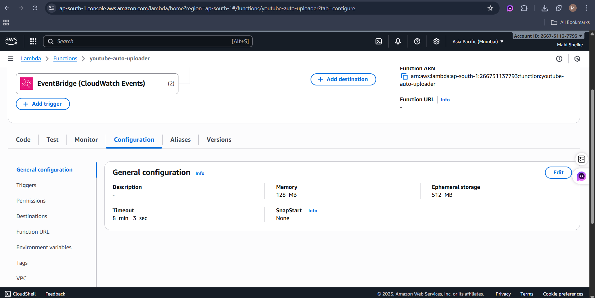

---

### 2. Amazon S3 (Simple Storage Service)
**Purpose:** Video storage  

**Role:**  
- Central repository for videos  
- Provides videos to Lambda  

**Configuration:**  
- Bucket: `cartoon-shorts-videos`  
- Folder: `meo`  


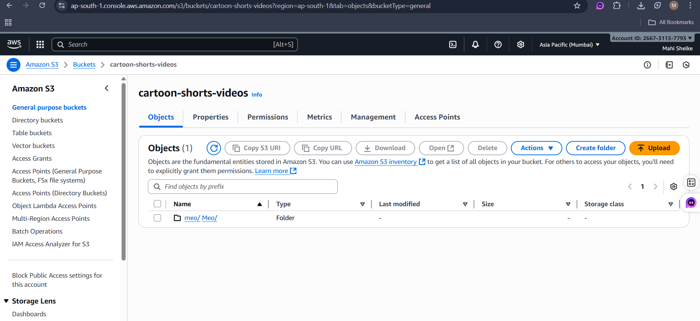
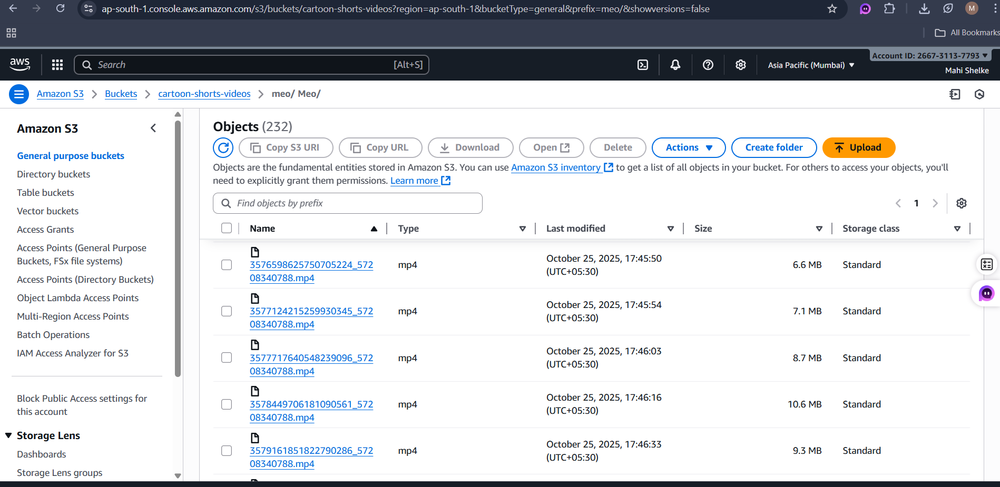

---

### 3. Amazon EventBridge
**Purpose:** Scheduling service  

**Role:**  
- Automatically triggers Lambda at **9 AM** and **8 PM** daily  

**Configuration:**  
- Cron Expression: `cron(0 9,20 * * ? *)`  
- Time Zone: Asia/Kolkata (IST)  
- Rule Name: `youtube-daily-uploads`  

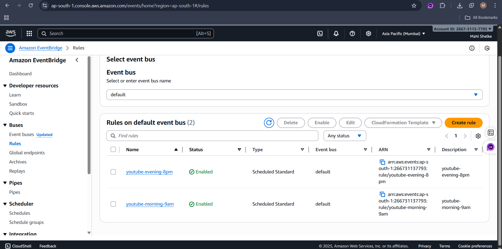
---

### 4. Amazon SNS (Simple Notification Service)
**Purpose:** Email notifications  

**Role:**  
- Sends notifications on video upload success/failure  
- Provides real-time email alerts  

**Configuration:**  
- Topic Name: `youtube-upload-notifications`  
- Protocol: Email  
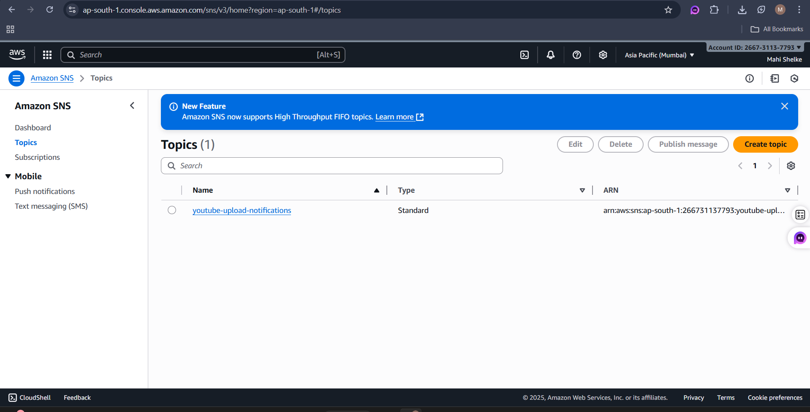
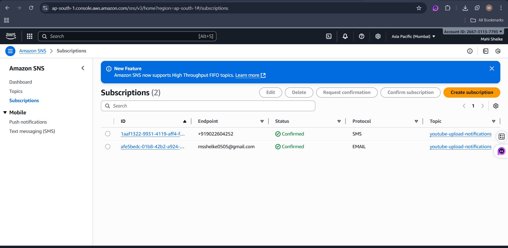
---

### 5. IAM (Identity and Access Management)
**Purpose:** Security and permissions  

**Role:**  
- Provides Lambda access to S3 and SNS  
- Manages secure credentials for all services


---
## 🌐 External APIs & Libraries

### 1. YouTube Data API v3
**Purpose:** Integration with YouTube for uploading videos  

**Libraries Used:**  
- `google-api-python-client`  
- `google-auth-oauthlib`  
- `google-auth-httplib2`  

---

### 2. Python Libraries
- `boto3` – AWS services interaction  
- `google-api-python-client` – YouTube API integration  
- `google-auth-oauthlib` – OAuth 2.0 authentication  

---

## 🔐 Authentication Setup - Token & Client ID

### How YouTube API Credentials Were Obtained

**Step 1: Google Cloud Console Setup**  
- Create a new project in Google Cloud Console  
- Enable **YouTube Data API v3**  
- Create **OAuth 2.0 Credentials**  

**Step 2: OAuth Consent Screen**  
- Select **External** user type  
- Add Scope: `https://www.googleapis.com/auth/youtube.upload`  
- Add test users  

**Step 3: Client Credentials**  
- Create **OAuth 2.0 Client ID**  
- Application Type: **Desktop App**  
- Download credentials in `client_secret.json` format  

**Step 4: Token Generation**  
- Run authentication flow locally  
- Log in via Google in browser  
- Approve permissions  
- Token generated and saved in `token.json`  

**Credentials Files**  
- `client_secret.json` – Google OAuth credentials  
- `token.json` – User authentication token
---
## 📊 Output & Results

### ✅ Success Metrics
### 1. 232 videos available in the S3 bucket  


### 2. Videos successfully uploaded to YouTube  
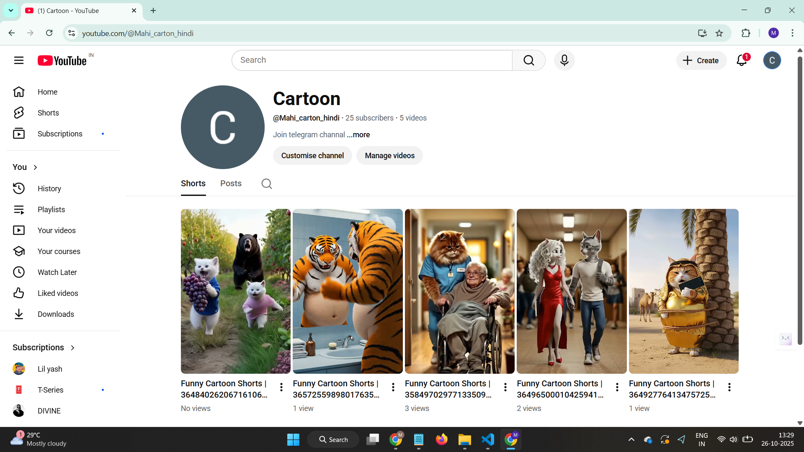

### 3. Email notifications working correctly 
 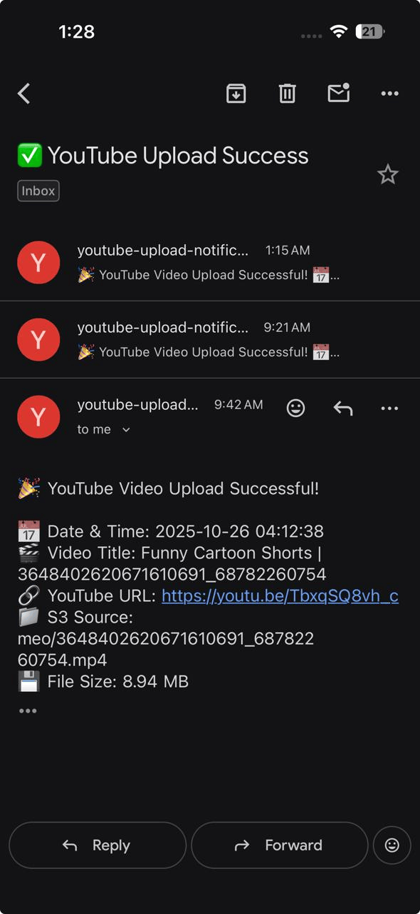

### 4. Scheduled automation running as expected  
 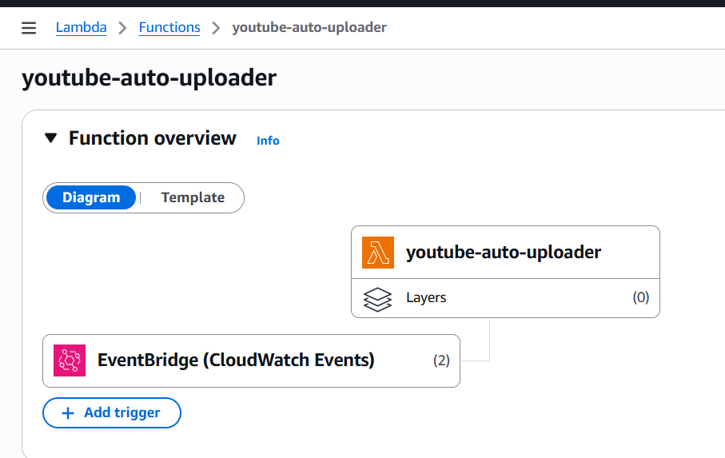

- Error handling implemented

## 🖥️ Sample Output

```json
{
  "status": "PUBLIC_UPLOAD_SUCCESS",
  "message": "Video successfully uploaded to YouTube!",
  "youtube_video_id": "ROKG9xZkJHM",
  "youtube_url": "https://youtu.be/ROKG9xZkJHM",
  "s3_video": "meo/3625273268770745059_68782260754.mp4",
  "timestamp": "2025-01-26 09:00:00 IST"
}
```
---
---

## 🔧 Maintenance & Monitoring

### Regular Checks
- **S3 Bucket Storage** – Ensure videos are available  
- **YouTube API Quota** – Monitor daily limits  
- **Lambda Logs** – Check for errors in CloudWatch  
- **SNS Notifications** – Verify email delivery  

### Troubleshooting
- **Authentication Issues** – Refresh token if required  
- **YouTube Quota** – Wait if daily limit exceeded  
- **S3 Permissions** – Ensure Lambda has proper access  
- **Network Issues** – Handle upload failures  

### Scaling
- **More Videos** – Upload additional videos to S3  
- **Multiple Channels** – Use different credentials for multiple channels  
- **Different Schedule** – Modify EventBridge rules for scheduling
---
## 💡 Future Enhancements

**Possible Improvements:**  
- Support for **multiple YouTube channels**  
- **Video analytics tracking**  
- **Automatic thumbnail generation**  
- **Smart video selection** (based on performance metrics)  
- **Dashboard** for monitoring uploads and statistics
---
🎯 Conclusion
Ye project complete end-to-end automation provide karta hai content creators ke liye. System reliably kaam karta hai aur manual effort ko 100% eliminate karta hai. AWS serverless architecture ki wajah se cost effective hai aur automatically scale ho sakta hai.

Key Achievements:

✅ Fully Automated - Zero manual intervention

✅ Cost Effective - Pay-per-use pricing

✅ Reliable - AWS managed services

✅ Scalable - Handle unlimited videos

✅ Monitorable - Complete visibility through notifications

Built with ❤️ using AWS Serverless Architecture
